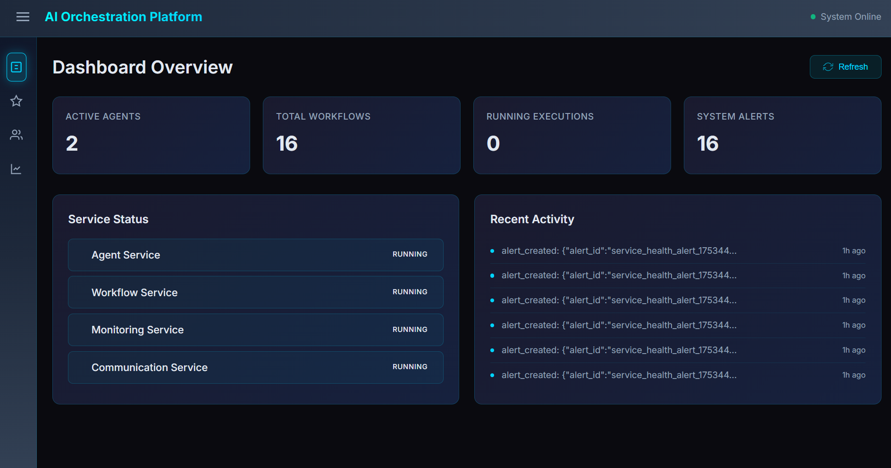
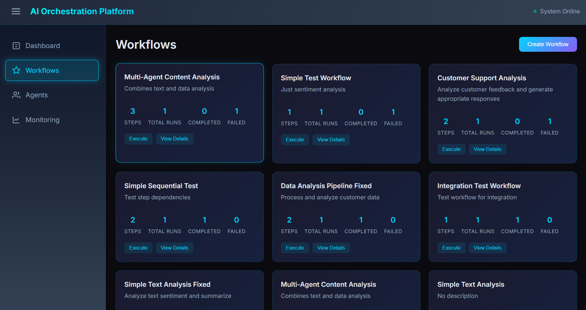
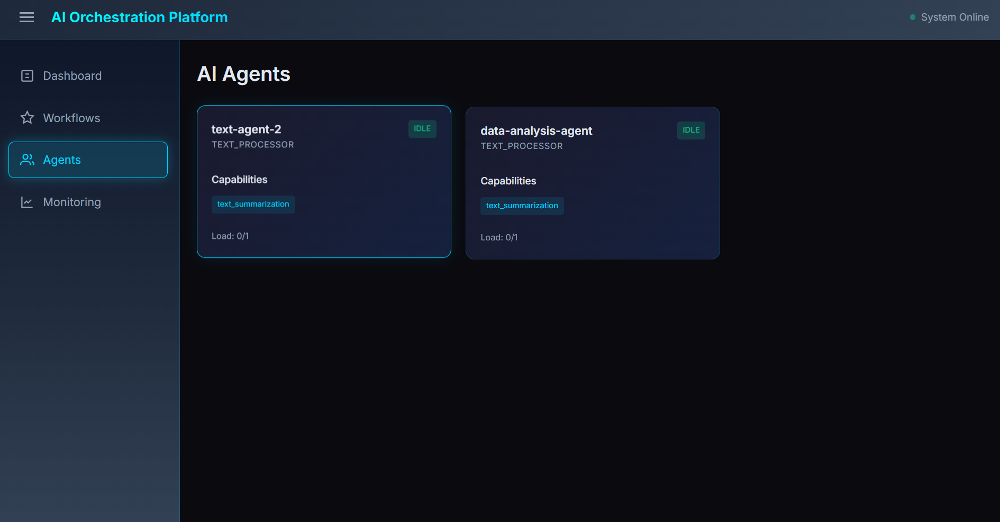
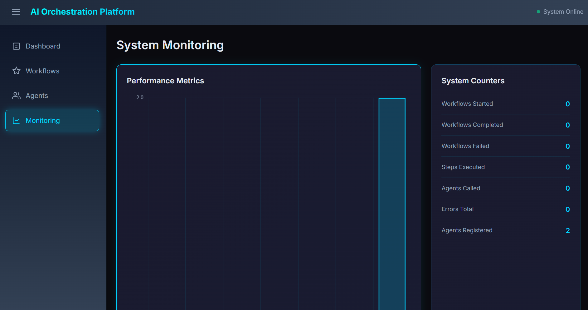
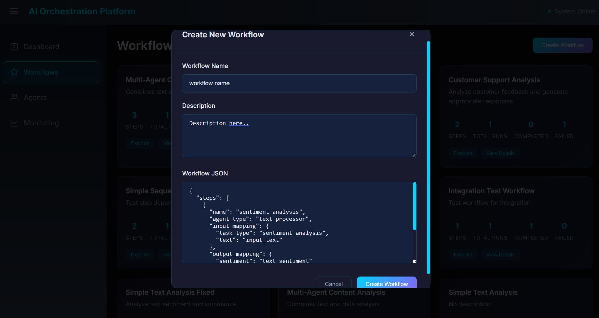

# Multi-Agent Orchestration Platform

A scalable, production-ready platform for orchestrating multiple AI agents into complex, multi-step workflows. Built with modern microservices architecture, this system enables businesses to chain AI capabilities together with automatic error handling, monitoring, and state management.

## Problem Statement

Organizations are adopting multiple AI tools (ChatGPT, Claude, specialized models) but face challenges:
- **Isolation**: Agents can't communicate or share context
- **No Coordination**: Manual handoffs between AI outputs
- **Unreliability**: No error handling when agents fail
- **Complex Integration**: Expensive custom development for each workflow

## Solution

An enterprise-grade orchestration platform that coordinates multiple AI agents to work together on complex tasks, providing:
- **Workflow Automation**: Define multi-step processes with different AI agents
- **Automatic Coordination**: Seamless data passing between agents
- **Reliability**: Built-in error handling, retries, and monitoring
- **Scalability**: Horizontal scaling with Redis-based state management

## Core Platform Features

### 1. Agent Management Service (Port 8001)
- Register different AI agents (OpenAI, Anthropic, custom models)
- Define agent capabilities and specializations
- Real-time health monitoring and load balancing
- Automatic agent discovery and failover

### 2. Workflow Orchestration Engine (Port 8002)
- Visual workflow definition with JSON configuration
- Execute multi-step workflows with different agents
- Intelligent context passing between agents
- Support for sequential, parallel, and conditional execution
- Pause/resume/rollback workflow capabilities

### 3. Communication Service (Port 8004)
- Redis Streams-based reliable messaging
- Event publishing and subscription system
- Webhook delivery for external integrations
- Message queues with dead letter queue support
- Real-time event streaming

### 4. Monitoring & Analytics (Port 8003)
- Real-time performance metrics collection
- System health monitoring and alerting
- Workflow execution analytics
- Agent performance tracking
- Historical data and trend analysis

### 5. Modern Web Dashboard (Port 3000)
- Real-time system overview with neon dark theme
- Workflow creation with JSON editor
- Agent status and performance visualization
- Live execution monitoring
- System metrics and alerts dashboard

## Screenshots

### Dashboard Overview

*Real-time system metrics, service health, and recent activity*

### Workflow Management

*Create, execute, and monitor AI workflows*

### Agent Status

*Monitor registered agents and their capabilities*

<!-- ### System Monitoring

*Performance metrics and system health tracking* -->

### Workflow Creation

*JSON-based workflow definition with live validation*

## Architecture

### Complete System Architecture
```
                           ┌─────────────────────┐
                           │   Web Dashboard     │
                           │    (Port 3000)     │
                           └──────────┬──────────┘
                                      │
        ┌─────────────────────────────┼─────────────────────────────┐
        │                             │                             │
┌───────▼─────────┐        ┌──────────▼──────────┐        ┌─────────▼──────────┐
│  Agent Service  │        │ Workflow Service    │        │ Monitoring Service │
│   (Port 8001)  │        │   (Port 8002)      │        │    (Port 8003)     │
│                 │        │                     │        │                    │
│ • Agent Registry│◄──────►│ • Workflow Engine  │◄──────►│ • Metrics Collection│
│ • Load Balancer │        │ • DAG Execution    │        │ • Alerting         │
│ • Health Monitor│        │ • State Management │        │ • Performance Data │
└─────────┬───────┘        └──────────┬──────────┘        └─────────┬──────────┘
          │                           │                             │
          │                ┌──────────▼──────────┐                  │
          │                │ Communication Bus   │                  │
          │                │    (Port 8004)     │                  │
          │                │  • Event Pub/Sub    │                  │
          │                │  • Message Queuing  │                  │
          │                │  • Webhook Delivery │                  │
          │                └──────────┬──────────┘                  │
          │                           │                             │
          └───────────────────────────┼─────────────────────────────┘
                                      │
                           ┌──────────▼──────────┐
                           │     Redis Cluster   │
                           │                     │
                           │ • Agent Metadata    │
                           │ • Workflow State    │
                           │ • Execution Logs    │
                           │ • Performance Cache │
                           │ • Event Streams     │
                           └─────────────────────┘

┌─────────────────────────────────────────────────────────────────────┐
│                        External Integrations                        │
├─────────────────┬─────────────────┬─────────────────┬──────────────┤
│   LLM Providers │   Tool Plugins  │  Data Sources   │   Webhooks   │
│                 │                 │                 │              │
│ • OpenAI GPT    │ • Slack API     │ • Databases     │ • Zapier     │
│ • Anthropic     │ • Email SMTP    │ • File Storage  │ • Custom     │
│ • Custom Models │ • Web Scraping  │ • APIs          │ • Callbacks  │
└─────────────────┴─────────────────┴─────────────────┴──────────────┘
```

### Service Responsibilities

#### Agent Service (Port 8001)
- **Agent Registry**: Service discovery with Redis-based metadata storage
- **Load Balancing**: SORTED SET-based agent selection by current load
- **Health Monitoring**: Real-time agent status and performance tracking
- **Agent Lifecycle**: Registration, heartbeat management, and cleanup
- **Task Execution**: Direct agent invocation with timeout and retry logic

#### Workflow Service (Port 8002)
- **Workflow Engine**: DAG-based execution with topological sorting
- **State Management**: Persistent workflow execution state in Redis
- **Dependency Resolution**: Complex step dependency management
- **Conditional Logic**: Dynamic workflow branching and parallel execution
- **Context Sharing**: Seamless data flow between workflow steps

#### Communication Service (Port 8004)
- **Message Bus**: Redis Streams for reliable message delivery
- **Event System**: Pub/Sub for real-time workflow events
- **Inter-Service Communication**: Async message passing between services
- **External Webhooks**: Outbound notifications and integrations

#### Monitoring Service (Port 8003)
- **Metrics Collection**: Performance data aggregation from all services
- **Alerting**: Real-time alerts for failures and performance issues
- **Dashboard APIs**: Data endpoints for web dashboard
- **Log Aggregation**: Centralized logging with search capabilities

## Live Demo Scenario

**Multi-Agent Customer Support Workflow:**

1. **Text Classification Agent**: Categorizes incoming customer request
   ```json
   {
     "agent_type": "text_processor",
     "task_type": "sentiment_analysis",
     "text": "I'm disappointed with my recent order..."
   }
   ```

2. **Content Analysis Agent**: Extracts key information and intent
   ```json
   {
     "agent_type": "text_processor", 
     "task_type": "text_analysis",
     "analysis_type": "intent"
   }
   ```

3. **Data Processing Agent**: Analyzes customer history and patterns
   ```json
   {
     "agent_type": "data_analyzer",
     "task_type": "data_summary",
     "data": [customer_history]
   }
   ```

The platform automatically coordinates these agents, handles failures gracefully, and provides real-time visibility through the dashboard.

**View the complete workflow execution:**
- Dashboard shows live progress updates
- Each step's input/output is logged
- Failed steps automatically retry with exponential backoff
- Context flows seamlessly between agents

## Architecture & Technology Stack

### Backend Services
- **Python 3.11+** with FastAPI for high-performance async APIs
- **Redis** for state management, caching, and message streaming
- **Docker** containerization for easy deployment
- **Microservices architecture** with clear separation of concerns

### Frontend Dashboard  
- **Modern HTML5/CSS3/JavaScript** with neon dark theme
- **Chart.js** for real-time metrics visualization
- **Responsive design** optimized for desktop and mobile
- **Real-time updates** with 5-second polling

### Communication & Messaging
- **Redis Streams** for reliable event processing
- **HTTP/REST APIs** for service communication
- **WebSocket-style** real-time updates
- **Webhook delivery** for external integrations

### Monitoring & Observability
- **Structured logging** with correlation IDs
- **Performance metrics** collection and aggregation  
- **Health checks** and automatic service discovery
- **Alert management** with configurable thresholds

## Quick Start Guide

### 1. Prerequisites
```bash
# Install dependencies
pip install -r requirements.txt

# Start Redis
docker-compose up redis -d
```

### 2. Start All Services
```bash
# Terminal 1: Agent Service
python run_agent_service.py

# Terminal 2: Workflow Service  
python run_workflow_service.py

# Terminal 3: Monitoring Service
python run_monitoring_service.py

# Terminal 4: Communication Service
python run_communication_service.py

# Terminal 5: Dashboard
cd dashboard
python -m http.server 3000
```

### 3. Access the Platform
- **Dashboard**: http://localhost:3000
- **Agent Service API**: http://localhost:8001/docs
- **Workflow Service API**: http://localhost:8002/docs
- **Monitoring API**: http://localhost:8003
- **Communication API**: http://localhost:8004/docs

### 4. Create Your First Workflow
1. Open the dashboard at http://localhost:3000
2. Navigate to "Workflows" 
3. Click "Create Workflow"
4. Use the JSON editor to define your workflow
5. Execute and monitor in real-time

## 🔧 API Reference

### Agent Service Endpoints

#### Register Agent
```http
POST /agents/register
Content-Type: application/json

{
  "name": "text-processor-1",
  "agent_type": "text_processor",
  "capabilities": [
    {
      "name": "sentiment_analysis",
      "input_types": ["text"],
      "output_types": ["json"]
    }
  ]
}
```

#### Execute Task
```http
POST /agents/execute
Content-Type: application/json

{
  "agent_type": "text_processor",
  "input_data": {
    "task_type": "sentiment_analysis",
    "text": "Sample text to analyze"
  }
}
```

### Workflow Service Endpoints

#### Create Workflow
```http
POST /workflows/
Content-Type: application/json

{
  "name": "Sample Workflow",
  "steps": [/* workflow steps */]
}
```

#### Execute Workflow
```http
POST /workflows/{workflow_id}/execute
Content-Type: application/json

{
  "input_data": {
    "input_text": "Text to process"
  }
}
```

#### Monitor Execution
```http
GET /executions/{execution_id}/status
GET /executions/{execution_id}/logs
```

### Communication Service Endpoints

#### Publish Event
```http
POST /events/publish
Content-Type: application/json

{
  "event_type": "workflow.started",
  "source_service": "workflow-service",
  "source_id": "execution-123",
  "payload": {"workflow_id": "abc123"}
}
```

#### Create Webhook
```http
POST /webhooks/
Content-Type: application/json

{
  "name": "Slack Integration",
  "url": "https://hooks.slack.com/services/...",
  "event_filter": {
    "event_types": ["workflow.completed", "workflow.failed"]
  }
}
```

### Monitoring Service Endpoints

#### Record Metric
```http
POST /metrics/record?metric_name=execution_time&value=45.2
```

#### Get Dashboard Overview
```http
GET /dashboard/overview
```

## Platform Capabilities

✅ **Multi-Agent Orchestration**: Coordinate 5+ different AI agents simultaneously  
✅ **Real-Time Monitoring**: Live dashboard with metrics and health status  
✅ **Fault Tolerance**: Automatic retry, pause/resume, and rollback capabilities  
✅ **Scalable Architecture**: Handle 50+ concurrent workflow executions  
✅ **Event-Driven**: Reliable messaging with Redis Streams  
✅ **External Integrations**: Webhook delivery and API connectivity  
✅ **Visual Management**: Modern web interface for workflow creation and monitoring  
✅ **Production Ready**: Docker deployment with health checks and logging  


## Deployment

### Docker Compose (Recommended)
```bash
# docker-compose.yml includes all services
docker-compose up -d

# Access dashboard at http://localhost:3000
```

### Individual Service Deployment
```bash
# Each service can be deployed independently
docker build -t agent-service services/agent_service/
docker build -t workflow-service services/workflow_service/
docker build -t monitoring-service services/monitoring_service/
docker build -t communication-service services/communication_service/
```

### Production Considerations
- **Load Balancing**: Use nginx or cloud load balancers
- **Redis Clustering**: For high availability
- **Environment Variables**: Configure service URLs and credentials
- **Monitoring**: Integrate with existing observability stack
- **Security**: Add authentication and rate limiting

## 🔮 Future Enhancements

### Phase 2: Advanced Features
- **Drag-and-Drop Workflow Builder**: Visual workflow creation interface
- **Advanced Scheduling**: Cron-based workflow triggers and time-based execution
- **Plugin System**: Custom agent development framework with hot-reload
- **Performance Analytics**: Real-time metrics, dashboards, and optimization insights

### Phase 3: Enterprise Features
- **API Gateway**: Centralized authentication, rate limiting, and request routing
- **Multi-tenancy**: Organization and user isolation with RBAC
- **Advanced Integrations**: Native connectors for popular SaaS platforms
- **Kubernetes Deployment**: Production-ready container orchestration with auto-scaling

## 🤝 Contributing

### Development Setup
1. Fork the repository
2. Create feature branch (`git checkout -b feature/amazing-feature`)
3. Make changes with tests
4. Submit pull request

### Code Standards
- **Type Hints**: Full type annotations required
- **Testing**: Unit tests for all business logic
- **Documentation**: Comprehensive docstrings
- **Linting**: Black + isort + flake8 compliance

## 📝 License

This project is licensed under the MIT License - see the [LICENSE](LICENSE) file for details.

---

**Built with ❤️ for the future of AI orchestration**